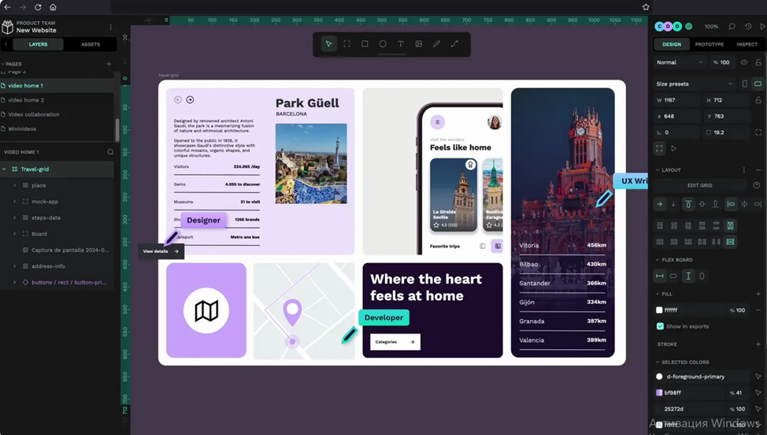
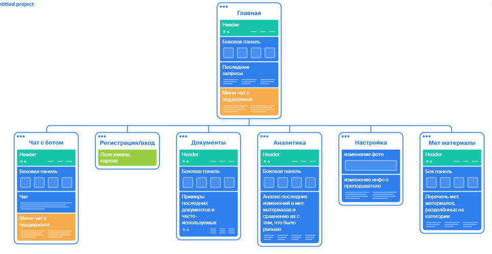
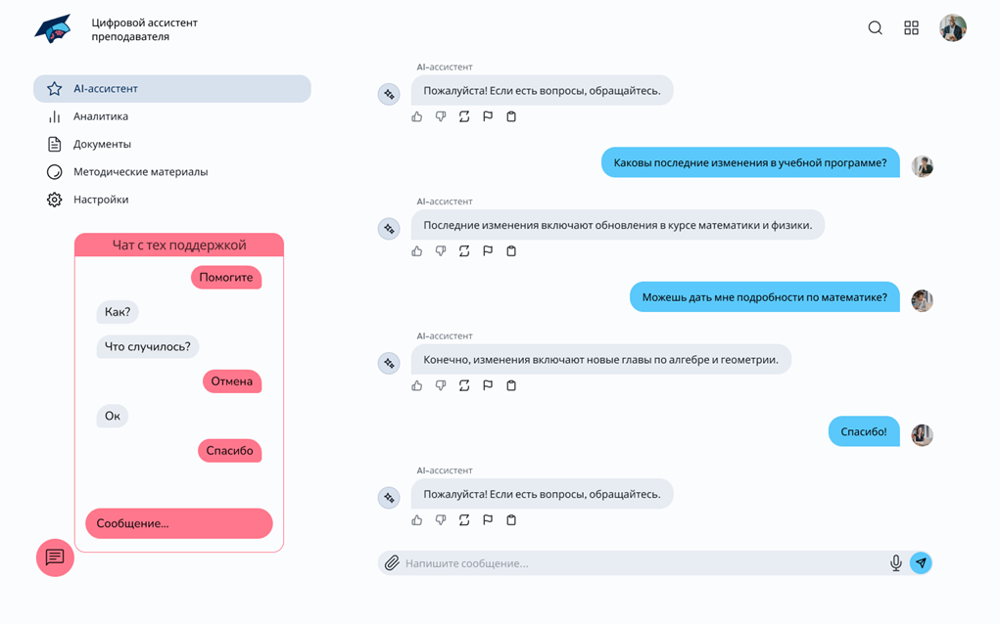

# Документация

- Папка для размещения документации по практике в формате Markdown.
- README.md — основной файл с документацией, описывающий процесс выполнения практики.
- При необходимости могут добавляться дополнительные файлы Markdown.

# ***Цифровой ассистент преподавателя***

## Руководитель проекта

Коновалова Мария Васильевна

## Участники проекта

1. Алибеков Бауыржан Пулатбек угли
2. Беляев Александр Юрьевич
3. Буторина Дарья Алексеевна
4. Гержод Екатерина Александровна
5. Гриднев Егор Михайлович
6. Демьянова Виктория Константиновна
7. Дёмин Матвей Игоревич
8. Казаков Никита Сергеевич
9. Колотилин Матвей Игоревич
10. Красова София Витальевна
11. Кузнецов Иван Викторович
12. Кузнецова Анастасия Владимировна
13. Мамыка Роман Данилович
14. Новицкая Елена Сергеевна
15. Поярков Николай Николаевич
16. Сикорский Максим Евгеньевич
17. Сотпа Саяна Орлановна
18. Хусанов Азизбек Умид угли

## Актуальность и проблематика проекта

Современные преподаватели сталкиваются с высокой нагрузкой, связанной с анализом успеваемости студентов, выявлением пробелов в знаниях, подготовкой отчетов и ведением документации. Эти рутинные задачи отнимают значительное количество времени, снижая эффективность образовательного процесса.
Использование цифрового AI-ассистента позволит автоматизировать эти процессы, повысить продуктивность преподавателей и улучшить качество образования.

## Суть проекта

Разработка и внедрение интеллектуального ассистента для преподавателей, который будет анализировать данные об успеваемости студентов, выявлять пробелы в знаниях, формировать отчеты и рекомендации, а также интегрироваться с образовательными системами.

## Цель проекта:

Разработка цифрового помощника для преподавателя, который не только значительно упрощает поиск необходимых методических материалов и документов, но и способен при необходимости автоматически генерировать их.

## Задачи:

1. Разработка концепта ИИ помощника: его основных функций
2. Анализ необходимых ресурсов для разработки
3. Дизайн прототипа и финального решения приложения
4. Разработка начального приложения и анализ ошибок
5. Разработка финального приложения
6. Внедрение второстепенных функций

## Взаимодействие с заказчиком

### Прямые заказчики:
- Полиграфический институт, Нагорнова Ирина Викторовна
- Преподаватели
- Косвенные заказчики:
- МГУ (московский гос. университет им. Ломоносова)
- МГППУ (московский государственный психолого-педагогический университет)
- онлайн школа GeekBrains
- Академическая гимназия (частная школа Начальные школы Академической гимназии)
- Университет Синергия
- МФЮА (московский финансово-юридический университет)
- Онлайн школа ИнтернетУрок
- Онлайн школа SOFT SCHOOL
- IT-колледж Хекслет

## Планируемы продуктовый результат:

В результате работы планируемый продукт является цифровым помощником преподавателя, который поможет ему найти любой методический материал и покажет все последние новости, а также сможет составить любой документ для заполнения по указу потребителя.

## Этапы реализации

### Образ идеального преподавтеля

1. Подробно объясняет сложные темы, используя адаптивные пояснения (текст, видео, интерактивные примеры).
2. Стимулирует понимание, предлагая аналогии, практические кейсы и интерактивные задания.
3. Оценивает объективно: анализирует решения студентов, дает развернутую обратную связь и объясняет ошибки.
4. Предлагает персонализированные задания, адаптированные под уровень знаний ученика.
5. Определяет пробелы в знаниях с помощью анализа успеваемости и рекомендаций по их устранению.
6. Развивает практические навыки, предлагая задачи, близкие к реальным сценариям в профессии.
7. Всегда открыт для обратной связи и готов ответить на любой вопрос ученика

### Образ идеального методического материала
1. Четко структурированы: логически выстроенные темы, последовательный рост сложности.
2. Объясняют, что изучается и как это применяется на практике.
3. Избегают резких скачков в сложности — переходы между уровнями обучения плавные.
4. Используют минимум узкоспециальных терминов или сопровождаются понятными объяснениями.
5. Актуальны, обновляются с учетом новых данных, технологий и методик.
6. Включают иллюстрации, схемы и визуализации там, где это облегчает восприятие информации.
7. Дают определения сложных терминов прямо в тексте или через всплывающие подсказки.
8. Содержат в себе дополнительную литературу для ознакомления

## Анализ конкурентов

### EDU-ASSIST
    Ссылка: https://edu-assist.me/
Описание: проект «СберОбразования». С помощью ИИ анализирует видео урока и предоставляет анализ по следующим критериям: распределение разговора, методические приемы, социологические приемы, скорость речи, эмоциональная модальность. Также предоставляет конспект урока.
Плюсы: с помощью этого сервиса можно понять ошибки при объяснении материала и скорректировать подход к обучению, чтобы ученики оставались вовлеченными.
Минусы: сервис платный (230 руб. за 135 мин.; 727 руб. за 450 мин.; 1377 руб. за 900 мин.)
Вывод:
Автоматическое конспектирование занятий может существенно облегчить работу преподавателей.
Наш проект стратегический, поэтому стоит отказаться от платы за функционал. Анализ видео занятий слишком тяжело реализовать.
Соседи (МГИМО)
Описание: Цифровой ассистент "Соседи" ориентирован на помощь преподавателям в организации учебного процесса, а также в проводимых научных исследованиях.
Плюсы:
- Широкий функционал, включая напоминания о сроках и контроль выполнения заданий.
- Возможность настройки персонализированного подхода к каждому преподавателю.
Минусы:
- Сложный интерфейс, требующий времени на изучение.
- Некоторые функции работают нестабильно или вызывают задержки, что отрицательно сказывается на пользовательском опыте.
### ASSISTANTS.EDU
    Ссылка: https://assistants.edu.ru/
Описание: проект, направленный на помощь ученикам, родителям, учителям.
Помощник ученика:
подготовка к экзаменам на основе верифицированного банка заданий
фиксация результатов подготовки и проработка наименее освоенных тем
таргетированный подбор цифрового образовательного контента на основе достижений
Помощник родителя:
Диагностика интересов и способностей детей
Навигация по событиям, олимпиадам, конкурсам, программам дополнительного образования и профессионального обучения, направленным на развитие способностей
Адресные рекомендации по образовательному контенту
Помощник учителя:
Агрегация сведений для аттестации и накопление педагогических достижений в портфолио
Навигация по программам повышения квалификации и профессиональным событиям
Персонализированный подбор программ, событий и образовательных материалов
Плюсы: разносторонний сервис, помогающий не только учителям, но и ученикам, и родителям. Бесплатный государственный сервис.
Минусы: База заданий предназначена для школьников с 5 по 9 классы.
### Ася (НИУ ВШЭ)
Описание: Ассистент "Ася" предназначен для упрощения взаимодействия преподавателей с учебным процессом. Он может помогать в составлении расписания, управлении заданиями и предоставлении информации о студентах.
Плюсы:
- Интуитивно понятный интерфейс.
- Способность к интеграции с другими университетскими системами.
- Наличие функций для автоматизации рутинных задач (например, проверка успеваемости).
Минусы:
- Ограниченные возможности анализа данных по сравнению с другими продуктами.
- Неполная информация о статистике использования преподавателями, что может усложнять его оптимизацию.
### KISPYTHON
    Ссылка: https://kispython.ru/ 
Описание: система, автоматизирующая курс программирования на языке Python в МИРЭА. Состоит из ядра, обеспечивающего порождение и проверку уникальных задач по программированию, а также интеллектуального модуля учёта учебных достижений для мотивации студентов к решению задач различающимися способами. 
Плюсы: мотивация студентов к решению разными способами. Автоматическая генерация заданий и их проверка. 
Минусы: обнаружить не удалось так как, доступ есть только у обучающихся в МИРЭА.
### Алиса (Яндекс)
Описание: Хотя "Алиса" в первую очередь позиционируется как универсальный голосовой ассистент, её функции могут быть адаптированы для образовательного контекста, включая помощь в ответах на вопросы и организации учебного процесса.
Плюсы:
- Хорошая обработка естественного языка и возможность взаимодействия через голос.
- Расширенные функции поиска информации, созданные на базе больших данных.
Минусы:
- Ограниченная возможность интеграции с университетскими системами.
- Необходимость постоянного интернет-соединения для полноценного функционирования.

Вывод: EDU-ASSIST самая приближенный сервис к идеи нашего проекта. Необходимо добавить генерацию методических материалов, документов и отчётов для преподавателей.

## Языки программирования

### Frontend (интерфейс пользователя)
    Языки и технологии: HTML, CSS, JavaScript
-	HTML – структура страницы
-	CSS – внешний вид (цвета, стили, шрифты)
-	JavaScript – логика на стороне клиента (анимации, формы и т.д.)

### Backend (серверная логика)
      Язык: PHP
      Почему PHP:
-	Один из самых популярных языков для веб-разработки.
-	Прекрасно интегрируется с MySQL.
-	Работает на большинстве хостингов без дополнительных настроек.
-	Идеален для небольших учебных и даже коммерческих проектов.
-	Низкий порог входа — понятен новичкам.

### База данных (хранение данных)
      Технологии: SQL, MySQL
      Почему:
-	SQL — стандартный язык работы с БД, поддерживается всеми крупными системами.
-	MySQL — популярная и надёжная СУБД с открытым исходным кодом.
-	Отлично работает с PHP (есть встроенные функции для соединения).
-	Имеется множество бесплатных инструментов для работы: phpMyAdmin, MySQL Workbench и т.д.

### Поддержка, управление и развертывание
      Инструменты: Git, phpMyAdmin
      Почему:
-	Git поможет сохранять изменения и работать в команде.
-	phpMyAdmin – удобный для новичков интерфейс для работы с MySQL.

## Среда прототипирования

### Фигма
Графический онлайн-редактор Фигма открывает широкое пространство для командной работы, также доступны десктопная версия и мобильное приложение, совместимые с популярными операционными системами. Фигма используется для решения следующих задач:
- создание прототипов сайтов и мобильных приложений;
- проектирование интерфейсов и их компонентов;
- работа с векторной графикой.
### Pixso
Pixso – хороший китайский аналог Фигмы. Здесь есть командная работа и все необходимое для UI/UX:
- автоматическая компоновка;
- варианты компонентов;
- UI/UX-дизайн и воспроизведение прототипов.
  предусмотрен бесплатный тариф с безлимитом для личных файлов и редакторов черновиков, а также 3 файла команды и страницы + 1 командный проект. История хранится в течение 30 дней.
### Lunacy
Lunacy подходит для операционных систем Windows, macOS, Linux. Поддерживает импорт из Фигмы, а также привычный инструментарий для UI/UX дизайна:
- автолейаут;
- компоненты и переменные;
- командная работа;
- темная тема;
- комментарии (текстовые и голосовые сообщения, стикеры);
- повторяющаяся сетка;
- онлайн и офлайн режимы;
- облачное хранилище;
- безграничное прототипирование.
  Фишка – потенциал искусственного интеллекта для:
- улучшения разрешения фото и иллюстраций;
- удаления фона с картинок;
- генерации текстов плейсхолдеров для интерфейсов;
- создания аватарок для проектов.
  Есть бесплатный тариф, позволяющий создавать до 10 облачных документов, растровые иконки и иллюстрации, фото – в низком качестве, нет инструментов с ИИ. Цена платных – от 15,98 долларов (около 1350 рублей) в месяц.
### Penpot
Платформа Penpot отличается открытым исходным кодом, здесь полный арсенал инструментов для проектирования, а также возможность объединения разработчиков и веб-дизайнеров. Что есть:
- дизайн интерфейса – от гибких макетов до дизайн-систем и пользовательских шрифтов;
- полноценное прототипирование;
- проведение проверки кода;
- совместная работа в режиме реального времени;
- адаптивный дизайн проектов;
- интерактивные прототипы;
- системы проектирования масштабов;
- управление шрифтами;
- режим просмотра и презентации;
- многоязычный пользовательский интерфейс.
  Можно применять встроенные шаблоны и библиотеки, прибегать к интеграциям и API, взаимодействовать в режиме разработчика. Есть центр помощи и много полезных материалов.
  Условия использования. Бесплатный тариф для небольших команд и частной разработки. Платные – от 175 долларов (около 15500 рублей) в месяц.
  Выбор среды
  Проанализировав несколько сред прототипирования, мы выбрали Penpot, поскольку это очень удобный инструмент для создания самых разных шаблонов. Есть прямая интеграция с кодом  html, xml, css и другими, а тарифный план позволяет широкую и бесплатную работы для группы разработчиков над любым проектом.
  

## Карта сайта

 
 
## Дизайн

 